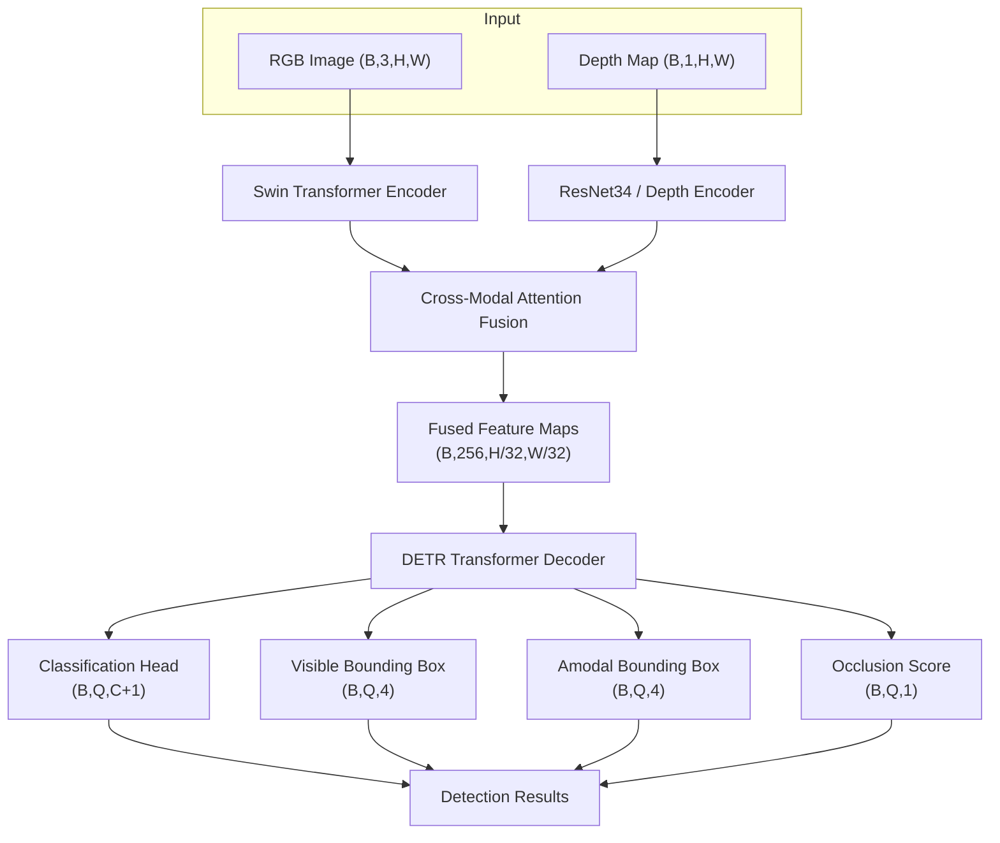

# SceneForge Architecture
## System Overview


## Components

### RGB Encoder — Swin-T
- Pretrained on ImageNet, outputs (B, 768, H/32, W/32)
- Captures hierarchical spatial features at multiple scales
- Frozen in Stage 1 training, unfrozen in Stage 3

### Depth Encoder — ResNet34
- Single-channel depth map replicated to 3 channels for pretrained weight compatibility
- Outputs (B, 512, H/32, W/32)
- Unfrozen in Stage 2 training

### Cross-Modal Attention Fusion
- Two bidirectional cross-attention blocks:
  - RGB queries depth (depth gates attention in occluded regions)
  - Depth queries RGB (RGB provides texture context to depth)
- Projects both streams to d_model=256, fuses via concat + linear
- This is the core architectural contribution

### DETR Detection Head
- Learnable object queries (100 by default)
- Transformer decoder attends over fused spatial features
- Four prediction heads per query:
  - Class logits (40 + 1 no-object)
  - Visible bounding box (cx, cy, w, h) normalised
  - Amodal bounding box (full predicted extent including hidden portions)
  - Occlusion score [0, 1]

### Depth Quality Gate
- Estimates sensor reliability from depth feature statistics
- When quality < 0.3, zeros out depth features (RGB-only fallback)
- Score surfaced in API response and tracked via Prometheus

---

## Training Strategy

### Staged Training
| Stage | Epochs | Trainable |
|-------|--------|-----------|
| 1 | 1–5 | Fusion + detection head only |
| 2 | 6–15 | Depth encoder + fusion + detection head |
| 3 | 16+ | Full end-to-end |

### Loss Function
| Component | Weight | Purpose |
|-----------|--------|---------|
| Cross-entropy | 1.0 | Classification |
| Visible bbox L1 | 5.0 | Localisation |
| Visible bbox GIoU | 2.0 | Box quality |
| Amodal bbox L1 | 2.0 | Full extent regression |
| Amodal bbox GIoU | 1.0 | Amodal box quality |
| Occlusion BCE | 1.0 | Occlusion score |
| Depth quality MSE | 0.5 | Sensor health proxy |

---

## Production Pipeline
## Production Pipeline

```text
Request
|
▼
FastAPI /predict
|
├──► Redis cache check (MD5 hash key, 5min TTL)
|
├──► SceneForge.forward(rgb, depth)
| |
| ├──► Depth quality gate
| ├──► Cross-modal attention fusion
| └──► DETR head → detections
|
├──► LangGraph agents (Perception → Risk → Coordination)
|
├──► RAG narrator (ChromaDB + LangChain + GPT-4o)
|
├──► Prometheus metrics update
├──► PostgreSQL inference_log (async)
└──► Response JSON
```

## Monitoring & Drift

- **Prometheus** scrapes `/metrics` every 10s
- **6 alert rules**: latency, confidence drift, depth sensor, error rate, queue size
- **PSI drift detection** runs weekly on confidence + depth quality distributions
- **Active learning loop**: low-confidence detections → human review → PostgreSQL → retrain trigger